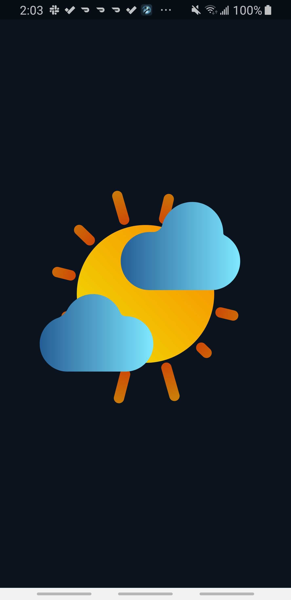
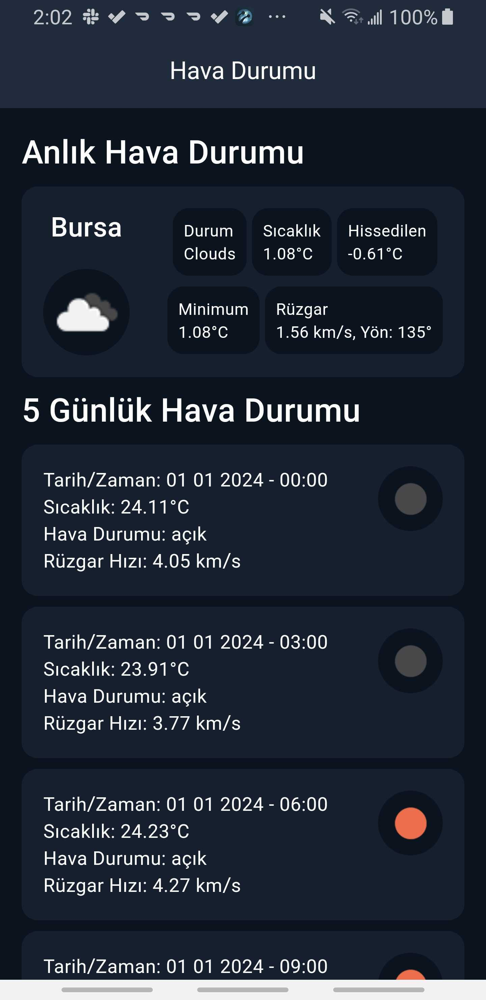

# sample_weather_app

# Hava Durumu Uygulaması

Bu uygulama, Flutter kullanılarak geliştirilmiş ve kullanıcının konum bilgisine göre güncel hava durumu bilgilerini gösteren bir mobil uygulamadır.

## Özellikler

- Kullanıcının konum bilgisine erişim.
- Konum bilgisi onaylandıktan sonra API üzerinden hava durumu verilerinin alınması.
- Alınan hava durumu verilerinin kullanıcıya gösterilmesi.

## Kurulum

Bu projeyi yerel olarak çalıştırmak için aşağıdaki adımları izleyin:

1. Bu depoyu klonlayın veya indirin.
2. Proje dizinine gidin.
3. Bağımlılıkları yüklemek için terminalde `flutter pub get` komutunu çalıştırın.
4. Uygulamayı bir emulator veya gerçek bir cihazda çalıştırın.

## Bağımlılıklar

Bu uygulama aşağıdaki Flutter paketlerini kullanmaktadır:

- `dio`: HTTP istekleri için.
- `flutter_screenutil`: Ekran boyutlandırma için.
- `lottie`: Animasyonlar için.
- `flutter_bloc`: State yönetimi için.
- `geolocator`: Konum bilgisi almak için.
- `permission_handler`: İzin yönetimi için.
- `intl`: Uluslararasılaştırma için.
- `shimmer`: Yükleme animasyonları için.

# Uygulama Ekran Görüntüleri

## Ana Sayfa

## Yükleme Durumu

## Detay Sayfası

 
